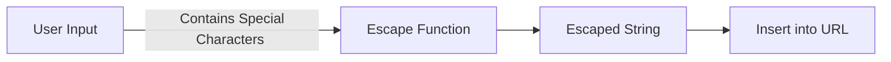

# Overview
Escaping is a key concept in computer science and web development, and pertains to the process of converting characters or sequences of characters into a different format for safe usage. This is done to prevent misinterpretation by systems, programming languages, websites, or protocols. It is therefore crucial in ensuring data integrity and security by avoiding issues like injection attacks, malformed data, and encoding conflicts.

# Why Escaping Matters
Escaping plays a critical role in:

- **Security** - Preventing malicious code injection (e.g., [[SQL Injection]], [[Cross-Site Scripting]]).
- **Data Integrity** - Ensuring that special characters do not interfere with data processing.
- **Communication** - Facilitating proper data exchange across different platforms and languages.

Consider the following hypothetical example of an [[SQL injection]] attack:

```sql
SELECT * FROM users WHERE username = '$username' AND password = '$password';
```

If `$username` is `admin` and `$password` is `anything' OR '1'='1`, the resulting [[SQL]] query would be:

```sql
SELECT * FROM users WHERE username = 'admin' AND password = 'anything' OR '1'='1';
```

Here, escaping can prevent the misuse of inputs by making the special characters in `password` harmless. It is also an example of ensuring your inputs are sanitised before applying them in your system.

# Types

## Character Escaping
Involves converting special characters to a safe format. For example, in [[HTML]], the `<` character can be escaped as `&lt;` to prevent it from being interpreted as a tag.

## URL Escaping
Special characters in URLs need to be escaped to ensure proper transmission over the internet. For example, a space character is represented as `%20`.



For more details, see [[URL Encoding]], an alternative name for escaping characters in URLs.

## String Escaping
Used in programming languages to represent special characters within string literals. For example, a newline character in [[Python]] is represented as `\n`.

## Shell Escaping
When using [[shell]] commands, escaping ensures that characters like spaces and dollar signs are treated literally rather than as operators or special symbols. In [[Bash]] for example, strings can be treated literally (escaped) by enclosing them in single rather than double quotes, or if in double quotes, prepending a backslash before the character to be escaped.

## Unicode Escaping
Involves escaping Unicode characters to ensure proper encoding and decoding between different systems. A Unicode character can be represented as `\uXXXX`, where `XXXX` is its code point.

# Escaping in Web Development
These days the need to escape is most likely to surface when dealing with web technologies. Because of that, we'll take a closer look at some examples.

## HTML Escaping
Within [[HTML]], escaping ensures that content is rendered correctly and not interpreted as code. For example, 

```html
<!-- Before Escaping -->
<p>Use <strong>alert('hello')</strong> carefully!</p>

<!-- After Escaping -->
<p>Use &lt;strong&gt;alert(&#39;hello&#39;)&lt;/strong&gt; carefully!</p>
```

## CSS Escaping
[[CSS]] selectors sometimes need escaping to handle special characters or numeric values starting with a digit.

```css
/* Before Escaping */
#1container
{
  color: red;
}

/* After Escaping */
#\31 container
{
  color: red;
}
```

## JavaScript Escaping
In [[JavaScript]], escaping is needed both within strings and when dealing with [[Regular Expression]] patterns.

```javascript
// Before Escaping
var str = "He said, "Hello!""; 

// After Escaping
var str = "He said, \"Hello!\""; 
```

## SQL Escaping
[[SQL]] queries must escape inputs to prevent malicious injections.

```sql
-- Before Escaping
SELECT * FROM users WHERE username = 'admin' AND password = 'password';

-- After Escaping
SELECT * FROM users WHERE username = 'admin' AND password = 'pass\'word';
```

# Episodes
```dataviewjs
await dv.view("/Meta/Scripts/Dataview/dv_ListedInEpisodesTable");
```
