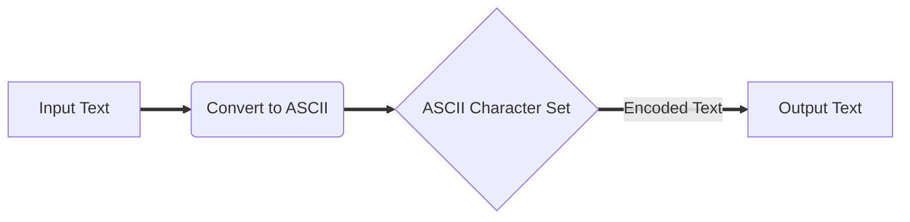

# Overview
Text encoding is a foundational concept in computer science that deals with the way characters are represented in digital form. It is essential for ensuring that text is displayed and processed correctly across different systems and applications.

At its core, text encoding is the process of mapping textual characters to binary data. In computers, everything is ultimately stored and processed as binary (numbers). To represent text, each character is assigned a unique "*code point*"[^1], which is then encoded into binary form for storage and transmission.

# Common Encoding Schemes
## ASCII Encoding
One of the earliest and simplest text encoding schemes is ASCII (American Standard Code for Information Interchange). ASCII uses 7 bits to represent 128 characters, including letters, numbers, punctuation marks, and control characters. It is a widely used encoding standard for English text.



## Unicode Encoding
With the increasing need to support multiple languages and character sets, the Unicode standard was introduced. Unicode assigns a unique code point to every character in the world's writing systems, including emojis and special symbols. This allows for a more universal and comprehensive text encoding system.


## UTF-8 Encoding
UTF-8 (Unicode Transformation Format-8) is a variable-length encoding scheme for Unicode characters. It uses 8-bit code units and can represent the entire Unicode character set. UTF-8 is backward compatible with ASCII, making it a popular choice for encoding text in modern applications. Unlike Unicode, this means it can support diacritic characters.


# Other Encoding Schemes
In addition to ASCII and Unicode, there are many other text encoding schemes that cater to specific languages and requirements. Examples include UTF-16, ISO-8859, and Shift JIS. It is crucial to choose the appropriate encoding scheme based on the language used and the compatibility requirements of the system.

# The Importance of Text Encoding
Proper text encoding is essential for ensuring that text is displayed and processed accurately in software applications. Without the correct encoding, text may appear garbled or unreadable, leading to communication errors and confusion. Compatibility issues can arise when text is transferred between systems with different encoding schemes.

By understanding text encoding principles and using standard encoding formats like Unicode and UTF-8, developers can create more robust and interoperable software applications. Text encoding is a foundational concept in computer science that underpins the way we interact with and communicate through digital text.

# Episodes
```dataviewjs
await dv.view("/Meta/Scripts/Dataview/dv_ListedInEpisodesTable");
```

---

[^1]: A code point is simply a fancy computer science term for a numerical value that uniquely represents a specific character in a particular character encoding system.