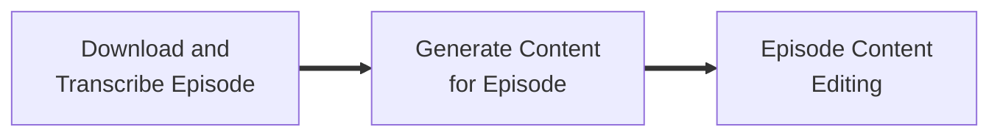
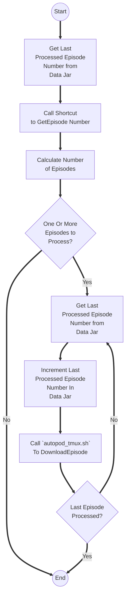
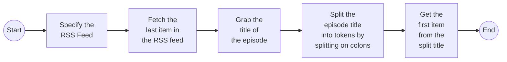
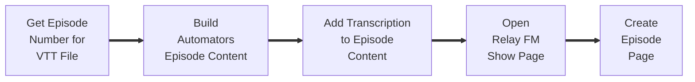
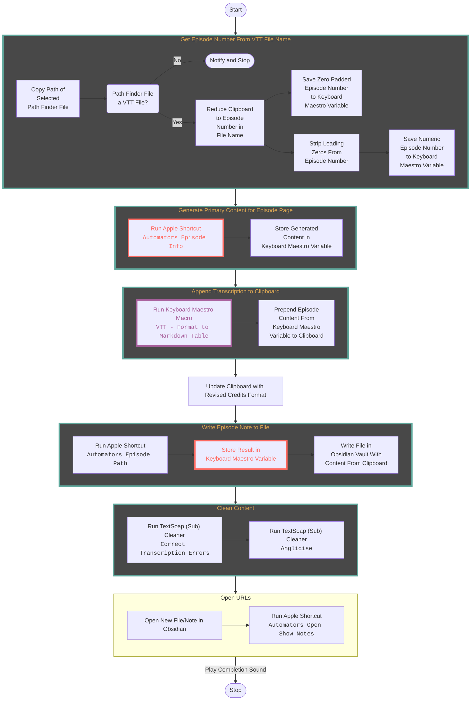
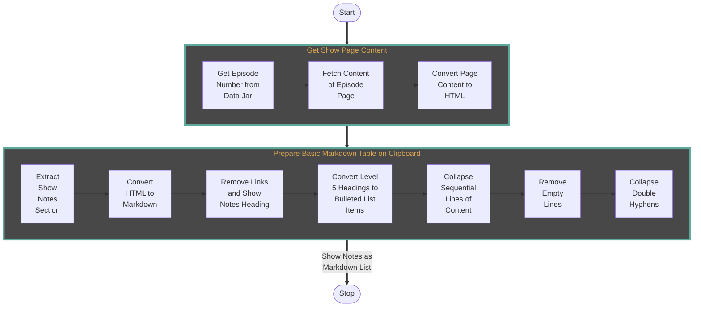
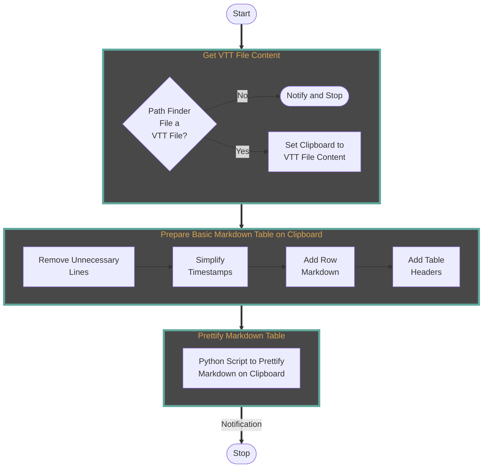
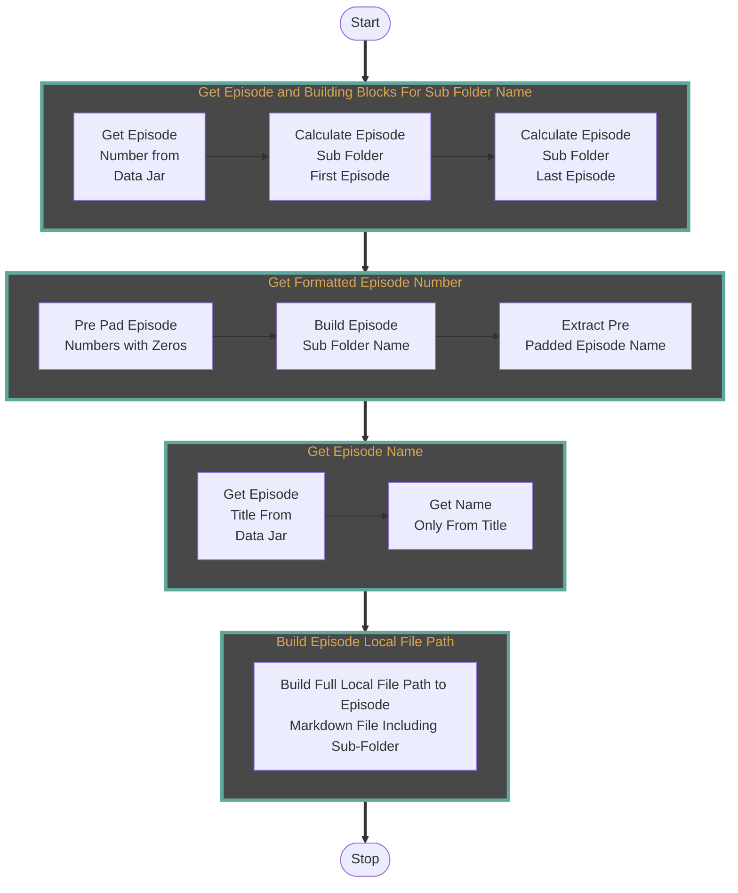
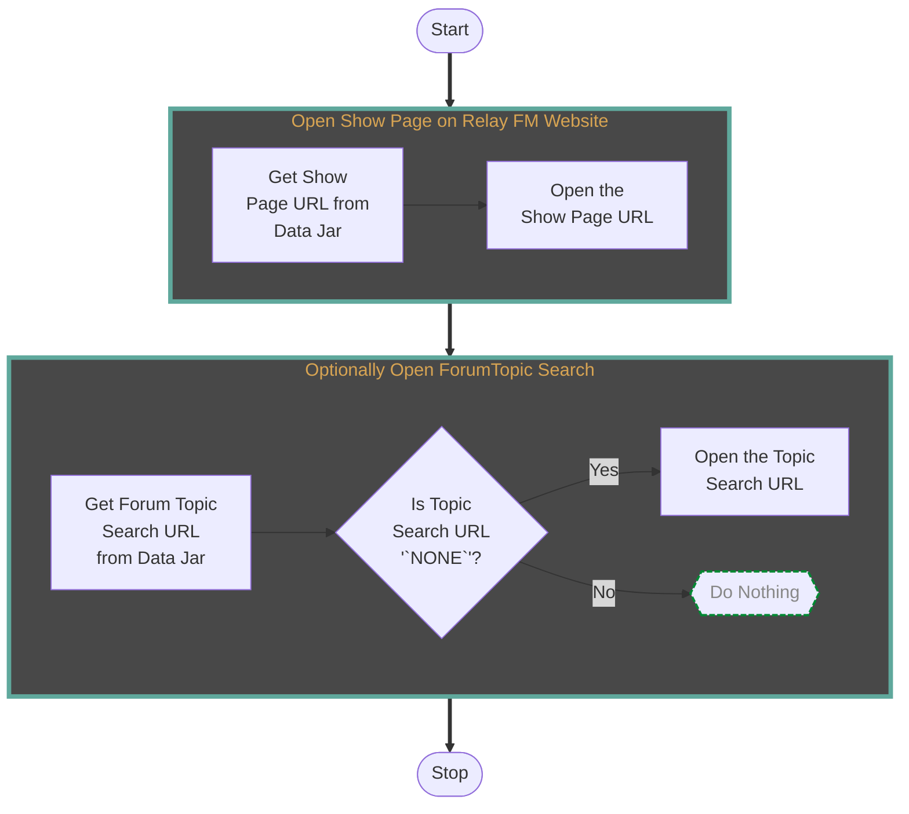

# Overall Build Process
The build process for an episode consists of three distinct stages.


1. The episode is downloaded and transcription occurs.
2. The episode details are generated.
3. The details and manually edited. 

## Future Improvements
> [!INFO] Efficiency
> Many of the bits and pieces of the automations were put together piecemeal over the course of pockets of time over the course of several months. As a result, the overall flow could be smoother and better use of stored data (e.g. in [[Data Jar]]) could be made in order to streamline processing. This is a known activity and will be done at some point, but for now just having a working solution and building out the content has been the focus.

# Download and Transcribe Episode

## Scheduled Check and Download/Transcription Trigger
**Automation Tools:** [[Keyboard Maestro]], [[Shortcuts]], [[Data Jar]], [[Shell Scripting|Shell Script]].

### Schedule
[[Keyboard Maestro]] is running on a headless Mac mini. It is scheduled to run a macro every 30 minutes between 17:00 GMT on Friday to 12:00 GMT on Saturday. The macro confirms that it is running on the Mac mini (because the macros are synced across multiple devices). Once  confirmed, it then runs the shortcut "Process Outstanding Automators Episodes"

**Macro Name:** Process Outstanding Automators Podcasts
**cron triggers:**
- `30 17-23 * * 5`
- `30 0-12 * * 6`
### Shortcut: Process Outstanding Automators Episodes
The shortcut determines if there are any podcast episodes to process and then triggers a separate process to process each of them is there are.


### Shortcut: Latest Automators Episode Number
This shortcut retrieves the last item from the RSS feed for the Automators podcast and parses the episode number from the feed.



**RSS Feed:** `https://www.relay.fm/automators/feed`

### Shell Script: autopod_tmux.sh
The shell script is used to trigger the [[#Automated Transcription]] script detailed below. In order to not have the shortcut time out and to be able to deal with small numbers of concurrent processing of episodes if necessary, a shell script is used to trigger the download and transcribe for a specific episode using a dedicated auto-closing [[tmux]] session.

The episode number is passed to the script as the first (and only) argument.

```zsh
#!/bin/zsh

# Define a name of a TMUX session based on the episode number so we do not get any clashes
tmuxsession="ep$1"

# Open a TMUX session with the name
tmux new-session -d -s "$tmuxsession"

# Run the autopod.sh script with the episode number ($1), and set it to exit the TMUX session when it completes
tmux send-keys -t "$tmuxsession" "/Users/stephen/podcast/autopod.sh $1 && exit" Enter

# Detach from the TMUX session to leave it running
tmux detach -s "$tmuxsession"
```

## Automated Transcription
**Automation Tools:** Shell Script.

For the episode transcription Open AI's [Whisper](https://github.com/openai/whisper) speech recognition is being used. This is managed via a script that downloads an episode and runs it through the Whisper's base level language model.

Currently I have a shell script named `autopod.sh` that does this, and also includes sending notifications to me via [Pushover](https://pushover.net). Please note that the tokens below are just random text strings and not actual valid API tokens. The podcast episode is downloaded to a `podcast` folder in my home directory on my old, headless, Mac mini. The transcription is then triggered and this generates SRT (SubRip Subtitle), TXT (plain text) and VTT (Video Text Tracks) files. The VTT file is the one that is ultimately used for the Markdown files for each episode.

```sh
#!/bin/zsh

function pushover
{
	# Set tokens
	PO_APP_TOKEN=yVI14u0gF4yPihjcR7w9umY9lxkz4i;
	PO_USER_TOKEN=RdnW5YmlU0OrjicpCQ4xOQp5TcPgqg;
	
	curl -s \
	--form-string "token=$PO_APP_TOKEN" \
	--form-string "user=$PO_USER_TOKEN" \
	--form-string "message=$1" \
	https://api.pushover.net/1/messages.json
}

function procAutomators
{
	cd $HOME/podcast
	filename="automators$1.mp3"
	pushover "Downloading Automators Episode $1"
	curl "https://www.podtrac.com/pts/redirect.mp3/traffic.libsyn.com/automatorsrelay/${filename}" -o "${filename}" -L
	pushover "Transcribing Automators Episode $1"
	echo "*** EP $1 START ***"
	whisper "automators$1.mp3" --language en
	echo "*** EP $1 END ***"
	pushover "Transcription of Automators Episode $1 Complete"
	rm "automators$1.mp3"
}

procAutomators "$1"
```

From the same folder as the script, Automators episode 123 can therefore be downloaded just by the terminal instruction `./autopod.sh 123`.

> [!INFO] Standalone Execution
> If this script is run standalone the [[Data Jar]] entry for the last processed episode should be updated if it is for a new episode. If not, the next time the scheduled job that utilises this script will end up doing the work again. Sine the scheduling was put in place, the idea is to only run this script manually to address prior erroneous runs.

# Generate Content for Episode
**Automation Tools:** [[Keyboard Maestro]], [[Python]] Script, [[Shell Scripting|Shell Script]], [[Shortcuts]], [[TextSoap]].



> [!Info] ⏰  Reminder
>This process is triggered within Path Finder on my local Mac via a [[Stream Deck]] button. Select the file, push the button, let the magic happen.

## Get Episode Number for VTT File
**Automation Tools:** [[Keyboard Maestro]], Shell Script.

This is based on the use of Path Finder for file management, and typically I would be remotely connecting using an SMB share to the Mac mini where the VTT files are generated and stored. Selecting an episode's VTT file, the name of the VTT file is available and includes the episode number.

To get the episode number, a regular expression is used.

| Find                           | Replace |
| ------------------------------ | ------- |
| `automators(\d\d\d)\.mp3\.vtt` | `$1`        |

This provides a three digit text string. What we want is the numeric value. For example if we start with "`001`", we really want just "`1`" for some things to come.

The quickest way I knew to force this was to do a quick calculation at the command line.

```sh
#!/bin/zsh
let "output = 0+ $(pbpaste)"
echo $output
```

The episode number is placed on the clipboard for the next step.

## Build Automators Episode Content
**Automation Tools:** [[Keyboard Maestro]], [[Shortcuts]].

The episode content build macro in [[Keyboard Maestro]] does a lot of the work and all of the orchestration to build the [[Obsidian]] file containing the base information for the episode. It relies on the VTT file discussed in the previous step having been generated and being selected in [[Path Finder]].  With the transcription file available, the macro will then set about gathering the additional information for the episode, and put the content into a file in the [[Obsidian]] vault.



Details about other [[Shortcuts|Apple Shortcuts]] and [[Keyboard Maestro]] macros that this macro uses can be found below.

- [[Shortcuts|Apple Shortcuts]]
	- `Automators Episode Info`
	- `Automators Episode Path`
	- `Automators Open Show Notes`
- [[Keyboard Maestro]]
	- `VTT - Format to Markdown Table` - see [[#Format Transcription]]

## Retrieve Episode Information
**Automation Tools**: [[Shortcuts]], [[Data Jar]]
**Shortcut:** `Automators Episode Info`  

This Apple Shortcut gathers and formats a base level of information about a particular episode. For testing, it can be passed an episode number directly, but in practice, it is passed the episode number via the clipboard.

Most of the data is retrieved directly from the RSS feed for the Automators podcast, but because the podcast starts at episode 0, we need to offset by one to generate a positional index of where to find an episode in the feed. In addition the [RSS2JSON API](https://rss2json.com) is also used to make it much easier to work with the feed.

The shortcut makes use of [[Data Jar]] to store some of the data. Primarily this is because there are other shortcuts that can benefit from accessing this data after it has been determined. But in addition, it  using [[Data Jar]] does help when breaking down the automation to test in stages, and it is useful to see the output stored, though a tool like [[Logger]] could be used in its place for that.

One of the data items retrieved is for the episode topic link. This is retrieved based on the episode number and title, but the podcast has not always generated topic pages, and not necessarily to the, what is now, standard naming. Therefore the shortcut also includes some logic to try and help deal with that, the results being saved in [[Data Jar]].

The Real FM show notes page is used to get some additional information not included in the feed, and to do this, a separate shortcut is used - see [[#Fetch Episode Show Notes]] for details.

The content this shortcut produces can require further editing as there may be data (such as topic links) that cannot easily be automatically accommodated. But overall, in just a matter of seconds, the shortcut retrieves and coerces a lot of disparate data into a useful format that would take a lot of manual effort to accomplish otherwise.

## Fetch Episode Show Notes
**Automation Tools**: [[Shortcuts]], [[Data Jar]]  
**Shortcut:** `Automators Fetch Show Notes`  

The Shortcuts to fetch the show notes queries the Relay FM site for the episode page, gets the HTML of the page, trims it to the show notes section, converts it to Markdown, and then simplifies the results to a Markdown list. This gets passed back to the calling shortcut for inclusion in the 




## Format Transcription
**Automation Tools:** [[Keyboard Maestro]], [[Python]] Script.

### Keyboard Maestro Macro
The process of transforming the output of the transcription into a prettier format for [[Obsidian]] is accomplished through the use of a [[Keyboard Maestro]] macro. Selecting the VTT file in Path Finder and running the macro places a reformatted Markdown table version of the transcription on the clipboard. Note that this relates back to the earlier selection of the VTT file to determine the episode number.

### Table Prettification Script
Table formatting is carried out using [`mdformat`](https://mdformat.readthedocs.io/en/stable/) and the [`mdformat-tables`](https://github.com/executablebooks/mdformat-tables) plugin.

To use these, you need to install them via `pip`.

```sh
pip install mdformat
pip install mdformat-tables
```

To utilise the plugin, it seems you have to write the code in Python. To that end a small script that will process content fed to it on standard input and format the tables is as follows.

```python
#!/usr/bin/env python3

import sys
import mdformat

# Prettify Markdown passed via standard in
print(mdformat.text(sys.stdin.read(), extensions={"tables"}))
```

However, the way I'm actually using this is on the clipboard, so to make things easier, we can install [`pyperclip`](https://pyperclip.readthedocs.io/en/latest/)

```sh
pip install pyperclip
```

Now a clipboard conversion script can be put together like this.

```python
#!/usr/bin/env python3

import pyperclip
import mdformat

# Prettify Markdown in place on the clipboard
pyperclip.copy(mdformat.text(pyperclip.paste(), extensions={"tables"}))
```

> [!INFO] Path Considerations in Keyboard Maestro
> Because I use this Python script inside a [[Keyboard Maestro]] macro with an [*Execute a Shell Script*](https://wiki.keyboardmaestro.com/action/Execute_a_Shell_Script) action, therefore I also needed to ensure that the [[Keyboard Maestro]] path variable (`ENV_PATH`) was also set up so that the imported modules could be found; [[Keyboard Maestro]] not picking up user profiles for command line shells.


## Generate Episode Note File Path
**Automation Tools**:[[Shortcuts]], [[Data Jar]]
**Shortcut:** `Automators Episode Path`  

This shortcut generates a full file path to the episode Markdown file. This includes the sub-folder the episode should be written to.

The sub-folders are split into blocks of 50: `000-049`, `050-099`, `100-149`, ....

## Open Relay FM Show Page
**Automation Tools**:[[Shortcuts]]
**Shortcut:** `Automators Episode Open Show Notes`  

This shortcut always opens the show page for the episode being processed. The page location can always be derived from the episode number.

If a single topic on the Automators forum could **not** be identified, then the shortcut will also open a search page for the episode. This will hopefully list the relevant episode topics for manual inclusion in the episode note.


# Episode Content Editing
## Edit Sponsors
The sponsors section needs to be manually edited each time as new sponsors come in or information about them can change, including the name of a sponsor.

## Cross Referencing
While a lot of the cross referencing is automatic, there is a need to manually go through and identify key terms, such as names of software or people, to cross reference to other pages in the vault. Many such pages are created as part of this process, and not all occurrences of a term are linked (purposefully). This has elements of research, creativity, and opinion to it, and so is currently not well suited to automation.

## Transcription and Show Note Corrections
I suspect that larger Whisper language models might give slightly better results, but transcriptions take a long time to run on old (Mac mini) hardware, and a quick spell check combined with some standard find and replace tasks produces something generally fit for purpose. Updating for mis-transcriptions as transcriptions are used is also not overly onerous, and occasionally typos can also creep into show notes, etc.