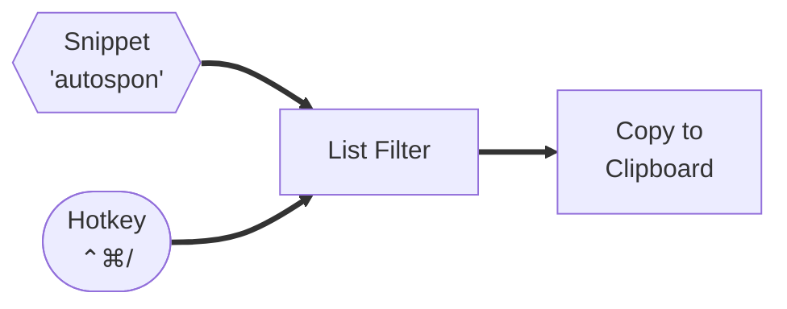

# Overview
Each sponsor has its own sponsor page specified as `{Name of Sponsor} (Sponsor)`,  that gets filed in the `/Sponsors` folder in the Obsidian vault. The link to these pages is followed by an ad read summary. This generally stays the same for a good period of time, but sponsors do change things up every now and then, and most sponsors sponsor more than one episode.

To make it easier to enter sponsors, and because there is such a range, a custom [[Alfred]]  workflow was created to make entry easier. This is actually just one of several supporting Alfred workflows for this vault.

## Workflow

There are two triggers. A text snippet, or a hotkey. These trigger a list filter in Alfred to appear. This lists out the sponsors by name. Entering a few characters into Alfred at this point filters the list until just the one required sponsor remains. Pressing enter copies the content into the clipboard and then immediately pastes it into Obsidian at the current cursor position (the *Automatically paste to frontmost app* option is enabled in the final step).

The interaction for long lists of options like this is easier to manage than in the current incarnation of TextExpander, and this has proven to be quick to use and easy to maintain.