# Overview
Hyper scheduling is a productivity technique that involves breaking down your day into small blocks of time and scheduling specific tasks or activities for each block. This method is designed to help individuals make the most of their time by being intentional about how they allocate their resources throughout the day.

# Benefits of Hyper Scheduling
One of the main benefits of hyper scheduling is that it helps individuals stay focused and on track throughout the day. By assigning specific tasks to specific time blocks, individuals are less likely to become distracted or waste time on unproductive activities.

Another benefit of hyper scheduling is that it can help individuals prioritise their tasks more effectively. By allocating specific time blocks to important tasks, individuals can ensure that they are dedicating enough time and attention to the things that matter most.

Additionally, hyper scheduling can help individuals improve their time management skills. By breaking down their day into small, manageable chunks, individuals can better estimate how long tasks will take and allocate their time accordingly.

# How to Hyper Schedule
- To start hyper scheduling, begin by dividing your day into small time blocks, such as 15 or 30-minute increments. 
- Make a list of all the tasks and activities you need to complete throughout the day. 
- Assign each task to a specific time block, making sure to leave some flexibility for unexpected interruptions or breaks.
- It is important to be realistic about how much time each task will take. 
- Be sure to account for breaks, meals, and other necessary activities when creating your schedule.
- As you go through your day, stick to your schedule as closely as possible.
- If you find that you are consistently running out of time for certain tasks, consider adjusting your schedule accordingly.

# Strategies for Effective Hyper Scheduling

- **Prioritise tasks:** Start your day by identifying the most important tasks that need to be completed. Schedule these tasks during your most productive hours.
- **Group similar tasks together:** Try to schedule similar tasks together to take advantage of momentum and minimise context switching.
- **Leave buffer time:** Schedule buffer time between tasks to account for unexpected delays or interruptions.
- **Use technology:** Consider using scheduling apps or tools to help you manage your hyper scheduling more effectively.
- **Reflect and adjust:** At the end of the day, take some time to reflect on how well you stuck to your schedule and adjust as needed for the next day.
  
# Hyper Scheduling Example

```mermaid
gantt
	dateFormat HH:mm
	axisFormat %H:%M
	title Example Hyper Scheduling Day

	section Morning
	Wake up          :sleeptime, 06:00, 06:30
	Breakfast        :eating, 06:30, 07:00
	Exercise         :activity, 07:00, 07:45
	Morning Routine  :work, 07:45, 08:15

	section Work
	Check emails    :work, 09:00, 09:30
	Project meeting :work, 09:30, 10:30
	Task 1          :work, 10:30, 11:30
	Lunch           :eating, 11:30, 12:30

	section Afternoon
	Task 2          :work, 13:30, 15:00
	Task 3          :work, 15:00, 16:30
	Break           :eating, 16:30, 16:45

	section Evening
	Task 4          :work, 17:00, 18:00
	Exercise        :activity, 18:00, 18:45
	Dinner          :eating, 18:45, 19:30
	Free time       :playtime, 19:30, 22:00
```




# Episodes
```dataviewjs
await dv.view("/Meta/Scripts/Dataview/dv_ListedInEpisodesTable");
```


