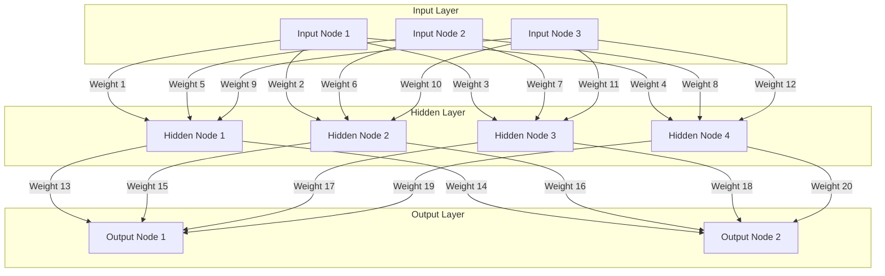

# Overview
A Neural Network is a type of computing system designed to mimic the way the human brain processes information. It is a key component in the field of [[Artificial Intelligence]] (AI) and is particularly good at finding patterns and making predictions based on large amounts of data. Neural Networks are used in a broad range of applications, from image and speech recognition to self-driving cars and medical diagnosis.

At its core, a Neural Network is made up of layers of interconnected nodes, similar to neurons in the brain. Each node in these layers performs a simple computation. When combined, these computations can tackle complex tasks.

# Structure

A basic Neural Network consists of three primary layers:

1. **Input Layer** 
	- This is the first layer where data enters the network.
	- Each node in this layer represents a feature or element of the input data.
2. **Hidden Layers**
	- These are the layers between the input and output layers.
	- Neural Networks can have one or more hidden layers.
	- Each layer helps to extract and process features from the input data.
	- The nodes in these layers are called neurons.
3. **Output Layer**
	- This is the final layer that produces the network's output.
	- The nodes in this layer represent the result of the computations, such as the label of an image or the prediction of a numerical value.

## Example



# How Neural Networks Learn
Neural Networks learn to perform tasks through a process called training. During training, the network is fed a dataset and adjusts its internal parameters, called weights and biases, to minimise errors in its predictions. This adjustment process typically involves an algorithm known as *backpropagation*

1. **Forward Pass** - input data passes through the network, layer by layer, to produce an output.
2. **Loss Calculation** - the network's output is compared to the actual target values using a loss function, which measures the difference (error) between the predicted and actual values.
3. **Backward Pass (Backpropagation)** - the error information is sent backward through the network, and the weights are adjusted to reduce the error in future predictions.
4. **Iteration** - the forward pass, loss calculation, and backward pass are repeated multiple times through many data samples until the network's predictions are sufficiently accurate.

# Uses
- Autonomous Robotics
- Diagnosis
- Forecasting
- [[Natural Language Processing]]
- Recognition: Speech & Image

# Limitations
- Neural networks need large amounts of data to train effectively.
- Training Neural Networks can be computationally expensive and time-consuming.
- It can be challenging to understand why a Neural Network makes certain decisions.
	- The "black box" problem.

# Episodes
```dataviewjs
await dv.view("/Meta/Scripts/Dataview/dv_ListedInEpisodesTable");
```
